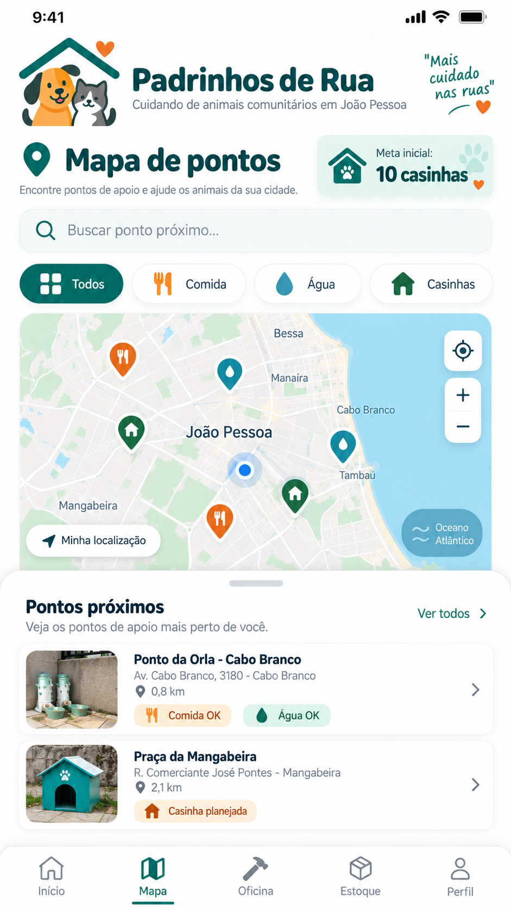
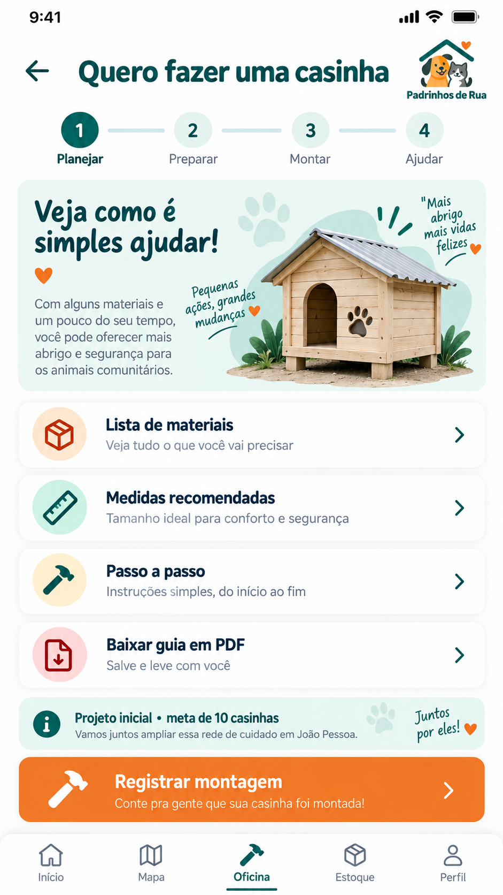
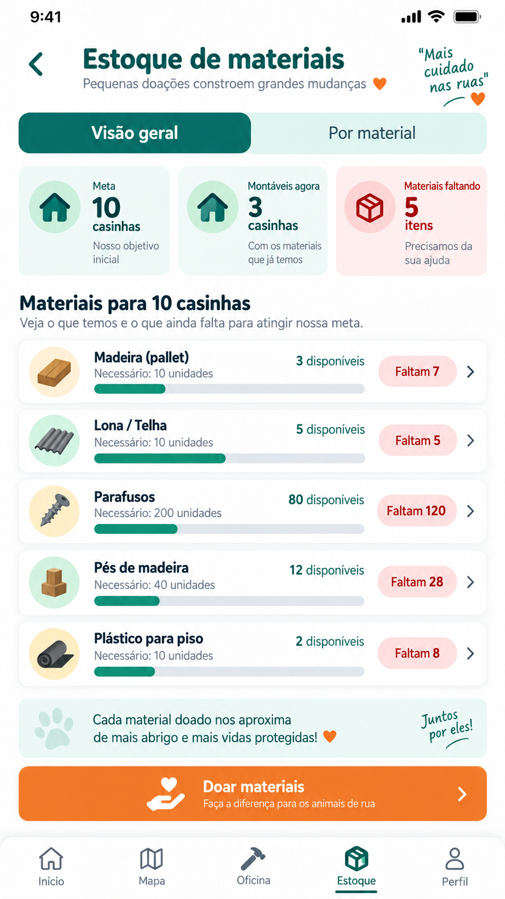

# 🐾 Padrinhos de Rua

> **Projeto de extensão do curso de Análise e Desenvolvimento de Sistemas (ADS) do UNIPÊ, com foco em tecnologia social aplicada ao bem-estar de animais comunitários em João Pessoa - PB.**

## 🎯 Finalidade do projeto

O **Padrinhos de Rua** foi concebido para aproximar tecnologia, universidade e sociedade em uma ação prática de apoio a animais em situação de rua. O projeto parte de uma necessidade social concreta - animais expostos à fome, sede, chuva, calor, abandono e falta de acompanhamento contínuo - e propõe uma solução comunitária apoiada por tecnologia.

A prioridade é **gerar impacto social**, organizando pontos de água e alimentação, voluntários, doações e a implantação gradual de abrigos comunitários. Por ser um projeto de extensão de **Análise e Desenvolvimento de Sistemas**, a solução também explora competências do curso, como levantamento de requisitos, UX/UI, desenvolvimento web mobile, PWA, organização de dados, controle de estoque, geolocalização, versionamento e evolução de software.

## 🌱 Por que este projeto é importante?

O abandono de animais é um problema socioambiental e de saúde pública. Animais comunitários dependem de moradores, comerciantes, protetores e voluntários para alimentação, água, proteção e encaminhamento de situações de risco. Sem organização, esses esforços podem ficar dispersos, ser interrompidos ou depender de poucas pessoas.

O projeto busca criar uma rede simples e escalável de colaboração, permitindo que a comunidade identifique pontos de apoio, acompanhe necessidades e contribua de forma objetiva. A tecnologia não substitui o cuidado humano: ela atua como ferramenta para **organizar, registrar, comunicar e dar continuidade** às ações.

## 🔎 Problemas identificados

- animais expostos ao sol, chuva, fome e sede;
- pontos de água e comida que dependem de reposição frequente;
- dificuldade de coordenar voluntários e responsáveis locais;
- falta de visibilidade sobre materiais disponíveis e materiais faltantes;
- risco de abandono dos pontos após o entusiasmo inicial;
- vandalismo, furto ou desgaste das estruturas físicas;
- necessidade de autorização para instalação em espaços públicos ou de terceiros;
- necessidade de manutenção contínua das casinhas, comedouros e bebedouros;
- necessidade de manutenção técnica do aplicativo e dos dados;
- limitação de recursos e dependência inicial de doações e parcerias.

## ✅ Objetivo geral

Desenvolver e validar uma solução de tecnologia social, em formato de aplicativo **mobile first/PWA**, que organize a colaboração comunitária em torno de pontos de água, alimentação e abrigo para animais comunitários em João Pessoa, integrando participação voluntária, acompanhamento dos pontos, controle simples de insumos e planejamento de casinhas comunitárias.

## 🎯 Objetivos específicos

- mapear e organizar pontos comunitários de apoio;
- facilitar o registro de necessidades e problemas;
- apoiar a reposição de água e alimento;
- organizar voluntários e contribuições;
- controlar materiais disponíveis e faltantes para construção das casinhas;
- disponibilizar um guia simples para que voluntários possam participar da montagem;
- acompanhar a construção e distribuição das casinhas;
- manter uma meta inicial realista de **até 10 casinhas** na fase piloto;
- documentar o projeto de forma que possa evoluir em novas turmas, projetos de extensão ou parcerias;
- aplicar conhecimentos de ADS em um problema social real.

## 📱 Como funciona?

O aplicativo foi redesenhado para uma experiência **mobile first**, com navegação simples em cinco áreas principais:

1. **Início** - apresenta o status do projeto e formas rápidas de ajudar.
2. **Mapa** - organiza os pontos comunitários de água, comida e abrigo.
3. **Oficina** - mostra o passo a passo básico de uma casinha e permite iniciar uma montagem.
4. **Estoque** - informa materiais disponíveis, necessidade total e itens faltantes.
5. **Perfil** - concentra a participação do voluntário e suas contribuições.

A fase atual é um **MVP acadêmico/piloto**. O fluxo mobile, a organização de materiais, a meta de 10 casinhas e os protótipos estão implementados. Funcionalidades de produção, como banco de dados persistente, autenticação, mapa cartográfico real, notificações oficiais e integração com órgãos públicos, permanecem como evolução futura.

## 🏠 Fase piloto: até 10 casinhas

A meta inicial foi deliberadamente limitada a **10 casinhas comunitárias**. O objetivo não é criar uma operação de grande escala neste primeiro momento, mas validar:

- interesse e adesão de voluntários;
- disponibilidade de materiais;
- facilidade de construção e manutenção;
- capacidade de acompanhamento pelo aplicativo;
- aceitação dos pontos pelas comunidades e parceiros;
- viabilidade de futuras parcerias.

Os pontos futuros somente devem ser considerados definitivos após validação do local e autorização do responsável pelo espaço.

## 👥 A quem o projeto se destina?

- animais comunitários e animais em situação de rua;
- moradores e cuidadores locais;
- protetores independentes;
- voluntários da comunidade;
- estudantes e equipe de extensão do UNIPÊ;
- comerciantes e empresas parceiras;
- pet shops, depósitos, madeireiras e estabelecimentos que possam doar insumos;
- ONGs e grupos de proteção animal;
- poder público, quando houver interesse e instrumento formal de parceria.

## 🧭 Responsabilidades e manutenção

### Manutenção física

A proposta é que cada ponto tenha, sempre que possível, um **voluntário ou cuidador de referência**, apoiado pela coordenação do projeto e pela comunidade local. Esse responsável ajuda a observar limpeza, água, alimento, conservação da estrutura e necessidade de reparos.

A participação de prefeitura, órgãos públicos, empresas ou instituições na manutenção física **não deve ser tratada como obrigação automática**. Uma responsabilidade formal somente existe quando houver convênio, termo de parceria, autorização ou instrumento equivalente definindo atribuições.

### Manutenção tecnológica

Durante a execução extensionista, a manutenção do código, protótipos e documentação fica sob responsabilidade da **equipe acadêmica de ADS**, com acompanhamento docente. O repositório GitHub registra a evolução do projeto e facilita continuidade e auditoria.

Para continuidade após o encerramento da atividade acadêmica, deverá ser indicado um novo mantenedor - por exemplo, nova equipe de extensão, laboratório/projeto institucional ou parceiro formal. Sem essa definição, não é adequado prometer suporte técnico permanente.

## 📦 Como serão obtidos os insumos?

A estratégia prioritária é utilizar doações e materiais de baixo custo ou reaproveitáveis, por meio de:

- doações de moradores e voluntários;
- parcerias com comércio local;
- pet shops, depósitos de construção, madeireiras e empresas;
- campanhas universitárias;
- apoio de ONGs e grupos de proteção;
- apoio público, caso exista parceria formal;
- reaproveitamento responsável de materiais adequados e seguros.

O aplicativo ajuda a tornar a necessidade objetiva: em vez de solicitar “qualquer doação”, o estoque pode informar exatamente **qual material está faltando e em qual quantidade**.

## 📣 E quando as doações não forem suficientes?

O projeto prevê campanhas direcionadas, por exemplo:

- divulgação da lista de materiais faltantes no aplicativo e nas redes sociais;
- compartilhamento em WhatsApp e grupos comunitários;
- campanha “adote um material” ou “ajude a completar uma casinha”;
- mutirões de arrecadação no UNIPÊ;
- abordagem de empresas e comércios parceiros;
- campanhas por bairro para necessidades específicas.

Caso futuramente exista arrecadação em dinheiro, ela deve ocorrer **somente por canal institucional ou parceiro formal autorizado**, com regras de transparência e prestação de contas. A fase inicial prioriza doação de materiais e serviços para reduzir complexidade financeira.

## 🛠️ Tecnologias utilizadas

- React
- TypeScript
- Vite
- Tailwind CSS
- Vite PWA
- Lucide React
- Git e GitHub
- prototipação mobile para reprodução no Figma

## 🧪 Estado atual do projeto

- ✅ fluxo mobile first consolidado;
- ✅ PWA compilando para produção;
- ✅ meta piloto limitada a 10 casinhas;
- ✅ controle simples de estoque e déficit;
- ✅ fluxo de oficina comunitária;
- ✅ protótipos mobile registrados no repositório;
- ✅ documentação do projeto em evolução;
- 🟡 mapa cartográfico real: evolução futura;
- 🟡 banco de dados persistente e autenticação: evolução futura;
- 🟡 notificações e integrações institucionais: evolução futura;
- 🟡 implantação física das casinhas: depende de materiais, voluntários e autorizações.

## 📊 Indicadores sugeridos para a fase piloto

- número de pontos ativos;
- frequência de reposição de água e comida;
- número de voluntários participantes;
- materiais arrecadados e déficit de estoque;
- casinhas planejadas, em montagem, prontas e instaladas;
- ocorrências reportadas e resolvidas;
- tempo médio entre alerta e atendimento;
- participação de parceiros locais;
- retorno da comunidade sobre facilidade de uso do aplicativo.

## ⚠️ Riscos e cuidados

- vandalismo e furto;
- abandono ou falta de manutenção do ponto;
- instalação sem autorização;
- materiais inadequados ou inseguros;
- exposição excessiva de localização ou dados pessoais;
- dependência de poucos voluntários;
- falta de continuidade técnica após o semestre/projeto;
- crescimento acima da capacidade real de manutenção.

A expansão deve ocorrer somente depois de avaliar os resultados da fase piloto.

## 🎨 Protótipos mobile

Os protótipos ficam em [`prototipos/mobile`](./prototipos/mobile) e incluem telas de boas-vindas, cadastro, mapa, detalhes do ponto, reporte, planejamento da casinha, estoque, doação, produção/distribuição, perfil e contribuições.

Exemplos:

| Mapa | Planejamento da casinha | Estoque |
|---|---|---|
|  |  |  |

## 🚀 Executando localmente

```bash
npm install
npm run dev
```

Verificação de tipos:

```bash
npm run lint
```

Build de produção:

```bash
npm run build
```

## 📚 Origem acadêmica

Projeto de extensão do curso de **Análise e Desenvolvimento de Sistemas - UNIPÊ**.

O projeto busca demonstrar como conhecimentos de desenvolvimento de software podem ser aplicados a uma necessidade social real, unindo **responsabilidade social, participação comunitária e tecnologia**.

## 📌 Nota de escopo

Este repositório representa um projeto acadêmico em fase piloto. Os locais ilustrativos e previsões de instalação não constituem autorização pública, compromisso da administração municipal ou obrigação de terceiros. Qualquer implantação em espaço público ou privado depende de validação e autorização do responsável competente.
