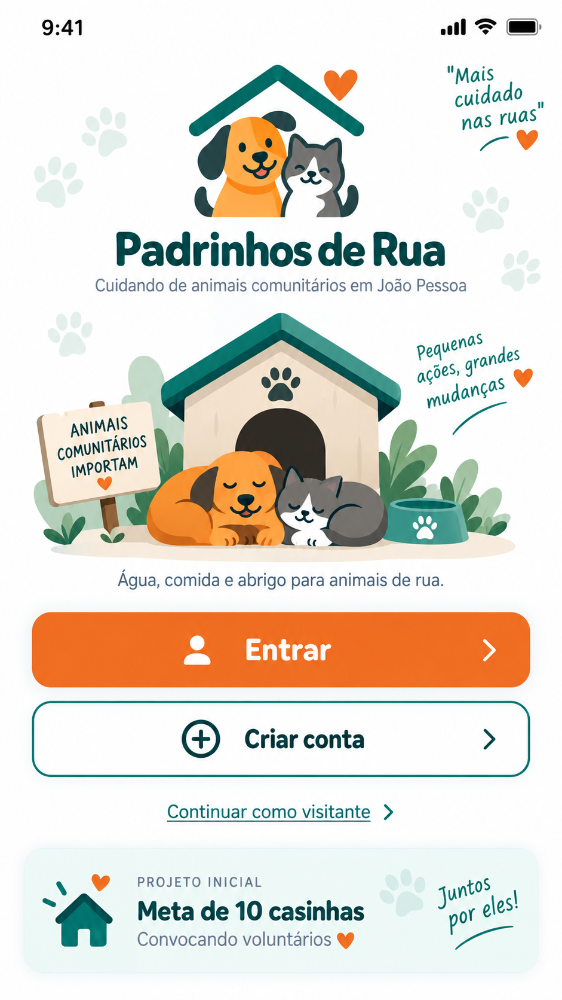
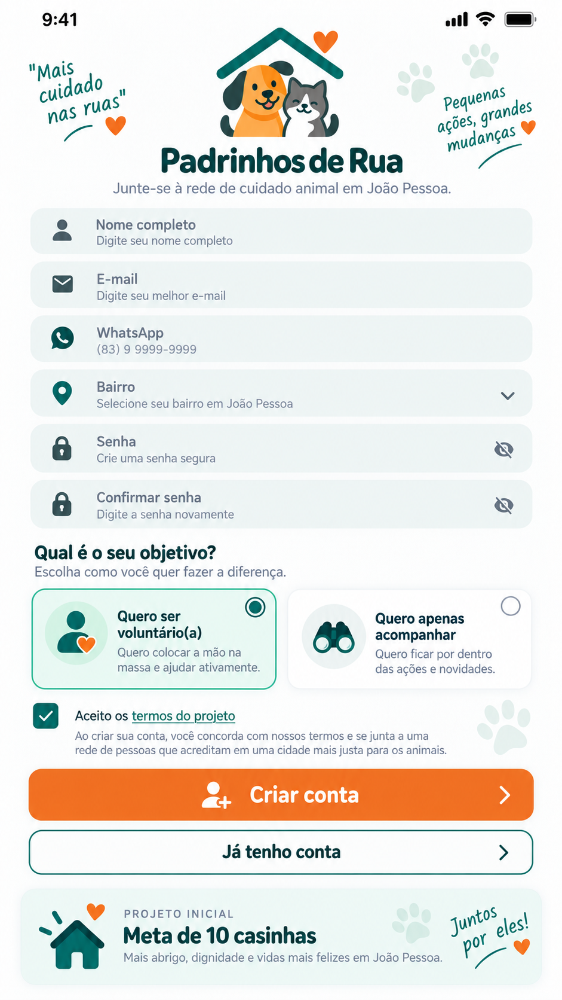
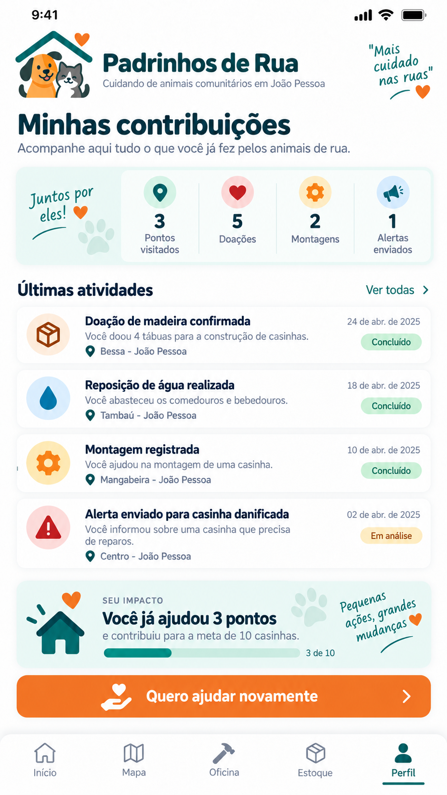
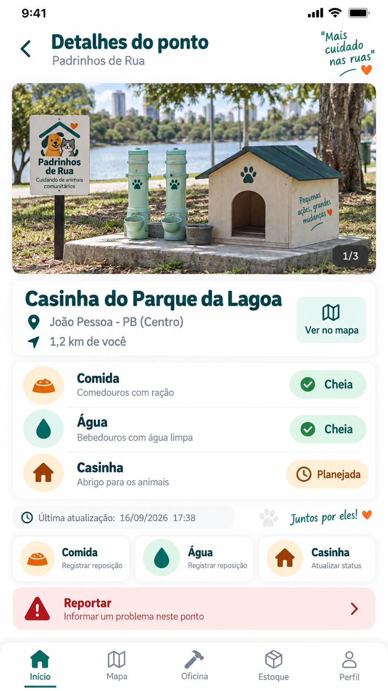
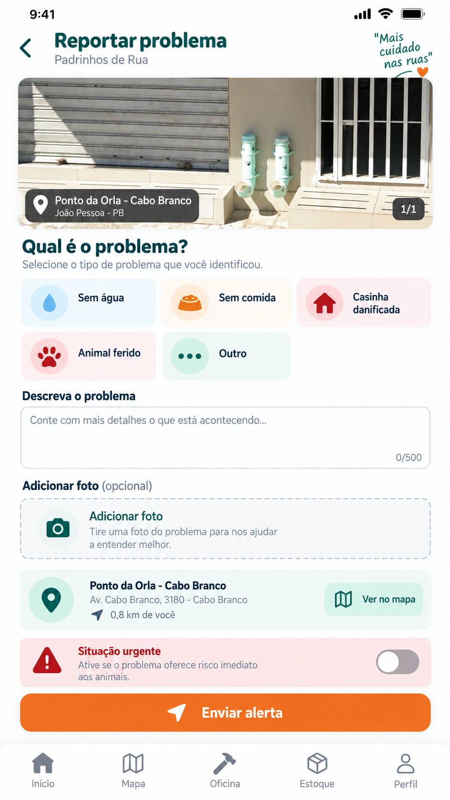
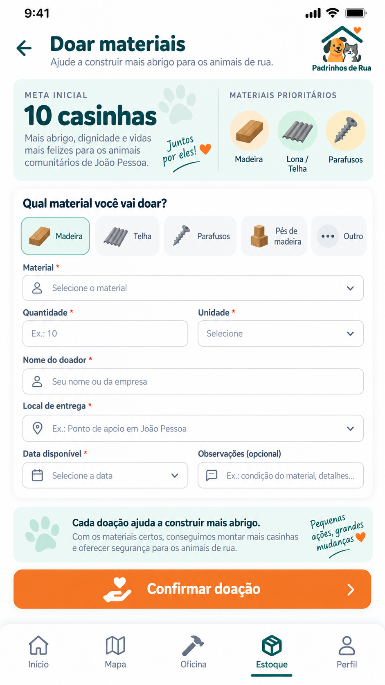
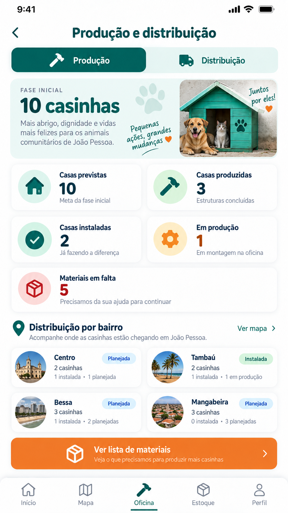
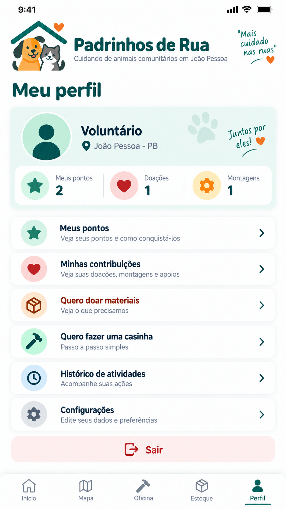

# 🐾 Padrinhos de Rua

> **Projeto de extensão de Análise e Desenvolvimento de Sistemas (ADS) do UNIPÊ, em fase de MVP acadêmico, que propõe tecnologia social para organizar o cuidado comunitário de animais em João Pessoa - PB.**

## Estado real do projeto

**Nenhuma casinha está instalada no momento.** A fase atual é de planejamento, prototipação e validação do fluxo tecnológico. A meta piloto é de **até 10 casinhas**, condicionada a necessidade comprovada, materiais adequados, responsáveis de referência e autorização do local.

Os pontos, quantidades de estoque e movimentações exibidos no MVP podem ser **dados demonstrativos**. Eles existem para testar a interface e não devem ser interpretados como execução física, parceria, doação ou atendimento real.

## Problema que o projeto procura enfrentar

Ações comunitárias de apoio a animais podem perder continuidade quando não há uma forma simples de acompanhar necessidades, responsáveis, reposição, manutenção, materiais e histórico. O Padrinhos de Rua propõe usar tecnologia para apoiar esse ciclo, sem substituir voluntários, protetores, instituições competentes ou atendimento veterinário.

**Pergunta orientadora:** como a tecnologia pode ajudar uma rede voluntária a manter pontos comunitários de apoio animal organizados e acompanhados ao longo do tempo?

## Proposta

O aplicativo é pensado como PWA/mobile first e organiza cinco frentes:

- **Início:** situação do piloto, indicadores e formas de participação;
- **Mapa:** visualização futura dos pontos e suas necessidades;
- **Oficina:** planejamento das casinhas e etapas anteriores à instalação;
- **Estoque:** materiais disponíveis, necessários e déficit;
- **Perfil:** participação do voluntário e resultados comprovados.

### Jornada operacional

`PONTO → NECESSIDADE → VOLUNTÁRIO → ATENDIMENTO → MANUTENÇÃO → REGISTRO → HISTÓRICO → INDICADORES`

O diferencial pretendido não é apenas criar casinhas ou um aplicativo, mas organizar a **continuidade do cuidado**.

## Separação entre planejamento e realidade

| Categoria | Significado |
|---|---|
| **Real/validado** | atividade de campo comprovada e autorizada |
| **Planejado** | intenção do piloto ainda não executada |
| **Demonstrativo** | dado fictício usado exclusivamente para testar o MVP |

Uma casinha só poderá constar como **instalada** depois de validação física e registro de evidência. Um local só poderá constar como ponto oficial depois de validação e autorização pertinentes.

## Impacto social esperado

O projeto pretende contribuir para:

- melhorar a organização das necessidades dos pontos;
- facilitar a participação de voluntários;
- direcionar doações de materiais para necessidades objetivas;
- registrar manutenção e reposições;
- reduzir a dependência de informação dispersa em mensagens e planilhas;
- permitir avaliação do piloto por indicadores;
- aproximar formação acadêmica em ADS de um problema social real.

Impacto esperado não é apresentado como resultado já alcançado. Resultados reais serão documentados somente após validação de campo.

## Viabilidade financeira

A fase inicial prioriza **doações de materiais e serviços**, sem arrecadação financeira direta pelo aplicativo. O orçamento do piloto deve separar:

1. materiais de construção e acabamento;
2. ferramentas e equipamentos de proteção;
3. identificação do ponto;
4. transporte/logística;
5. manutenção e substituições;
6. contingência.

A fórmula básica proposta é:

`Necessidade financeira = custo total validado - materiais/serviços doados e comprovados`

Qualquer futura arrecadação em dinheiro deve usar canal institucional ou parceiro formal autorizado, com prestação de contas.

## Contexto municipal e independência

O levantamento documental identificou iniciativas legislativas municipais relacionadas a comedouros/bebedouros, abrigos sustentáveis e aplicativo de adoção. Elas são registradas **apenas como contexto local**.

> **O Padrinhos de Rua é um projeto extensionista, acadêmico e voluntário desenvolvido de forma independente, sem vínculo institucional, político, administrativo ou operacional com proposições legislativas, seus autores, a Câmara Municipal ou a Prefeitura de João Pessoa.**

A convergência está no problema social. O escopo do Padrinhos de Rua está na organização tecnológica e voluntária da continuidade operacional dos pontos.

Veja: [`docs/CONTEXTO_E_DIFERENCIACAO.md`](./docs/CONTEXTO_E_DIFERENCIACAO.md).

## Tecnologias do MVP

- React 19
- TypeScript
- Vite
- Tailwind CSS
- Vite PWA
- Lucide React
- Git/GitHub

O código principal não utiliza IA, Express, chaves externas, câmera ou geolocalização nesta fase. As dependências diretas foram revisadas para manter apenas o necessário ao MVP; dependências transitivas permanecem somente quando exigidas pelas ferramentas utilizadas.

## Documento acadêmico principal

- [Relatório Acadêmico Consolidado - PDF](./docs/Padrinhos_de_Rua_Relatorio_Academico_Consolidado.pdf)
- [Relatório Acadêmico Consolidado - DOCX](./docs/Padrinhos_de_Rua_Relatorio_Academico_Consolidado.docx)
- [Planilha de Viabilidade Financeira do Piloto](./docs/Planilha_Viabilidade_Financeira_Piloto.xlsx)

## Protótipos

O repositório possui **11 telas mobile** produzidas ao longo da evolução do projeto. Elas são apresentadas abaixo como uma jornada visual do aplicativo.

> **Importante:** estas telas são protótipos acadêmicos/demonstrativos. Valores, locais, quantidades, contribuições, pontos e demais informações exibidas nas imagens podem ser fictícios e não representam execução física, parceria, atendimento ou instalação já realizada.

<table>
  <tr>
    <td align="center"><strong>1. Boas-vindas</strong><br></td>
    <td align="center"><strong>2. Cadastro</strong><br></td>
    <td align="center"><strong>3. Minhas contribuições</strong><br></td>
  </tr>
  <tr>
    <td align="center"><strong>4. Mapa de apoio animal</strong><br></td>
    <td align="center"><strong>5. Detalhes do ponto</strong><br></td>
    <td align="center"><strong>6. Reporte</strong><br></td>
  </tr>
  <tr>
    <td align="center"><strong>7. Estoque de materiais</strong><br></td>
    <td align="center"><strong>8. Doação de materiais</strong><br></td>
    <td align="center"><strong>9. Planejamento da casinha</strong><br></td>
  </tr>
  <tr>
    <td align="center"><strong>10. Produção e distribuição</strong><br></td>
    <td align="center"><strong>11. Perfil</strong><br></td>
    <td align="center"><strong>Jornada visual do MVP</strong><br><br>As telas ajudam a demonstrar como o projeto evolui da entrada do usuário até o acompanhamento de pontos, materiais, produção e participação voluntária.</td>
  </tr>
</table>

A organização detalhada, o status de cada tela e as regras de leitura estão descritos em [`prototipos/README.md`](./prototipos/README.md), incluindo a separação entre **protótipo visual**, **funcionalidade implementada**, **implementação parcial** e **evolução futura**.

## Documentação de apoio

- [`docs/PROJETO_EXTENSIONISTA_COMPLETO.md`](./docs/PROJETO_EXTENSIONISTA_COMPLETO.md)
- [`docs/CONTEXTO_E_DIFERENCIACAO.md`](./docs/CONTEXTO_E_DIFERENCIACAO.md)
- [`docs/IMPACTO_PROS_CONTRAS.md`](./docs/IMPACTO_PROS_CONTRAS.md)
- [`docs/VIABILIDADE_FINANCEIRA.md`](./docs/VIABILIDADE_FINANCEIRA.md)
- [`docs/REQUISITOS.md`](./docs/REQUISITOS.md)
- [`docs/REGRAS_DE_NEGOCIO.md`](./docs/REGRAS_DE_NEGOCIO.md)
- [`docs/MODELO_DE_DADOS.md`](./docs/MODELO_DE_DADOS.md)
- [`docs/PRIVACIDADE_E_SEGURANCA.md`](./docs/PRIVACIDADE_E_SEGURANCA.md)
- [`docs/OPERACAO_E_MANUTENCAO.md`](./docs/OPERACAO_E_MANUTENCAO.md)
- [`docs/INDICADORES_E_VALIDACAO.md`](./docs/INDICADORES_E_VALIDACAO.md)
- [`docs/ROTEIRO_VIDEO_DEMONSTRACAO.md`](./docs/ROTEIRO_VIDEO_DEMONSTRACAO.md)
- [`docs/LIMPEZA_E_REAPROVEITAMENTO_CODIGO.md`](./docs/LIMPEZA_E_REAPROVEITAMENTO_CODIGO.md)

## Executando localmente

```bash
npm ci
npm run validate:project
npm run lint
npm run dev
```

Validação completa (coerência + TypeScript + build):

```bash
npm run check
```

O GitHub Actions executa automaticamente validação de coerência, TypeScript e build em pushes e pull requests para `main`.

## Limites do MVP

Nesta etapa, não são tratados como concluídos: banco compartilhado de produção, autenticação, mapa cartográfico real, notificações oficiais, parceria institucional, implantação física das casinhas ou validação comunitária formal.

## Origem acadêmica

Projeto de extensão do curso de **Análise e Desenvolvimento de Sistemas - UNIPÊ**.

Responsável geral pelo material consolidado: **Priscilla Santos Cahino**.
